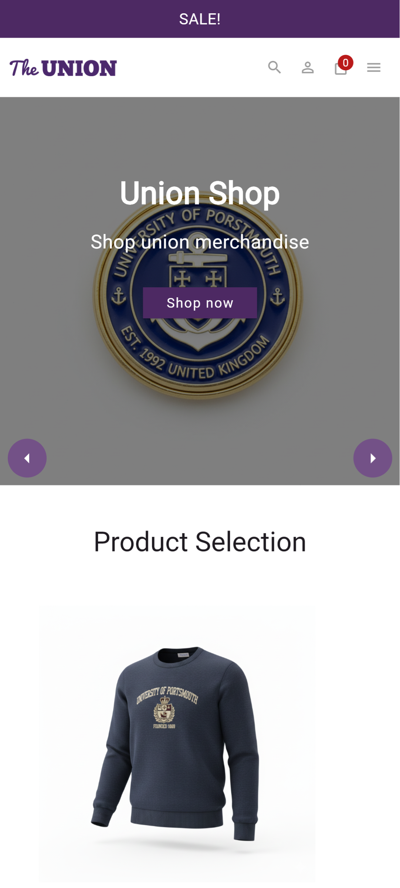
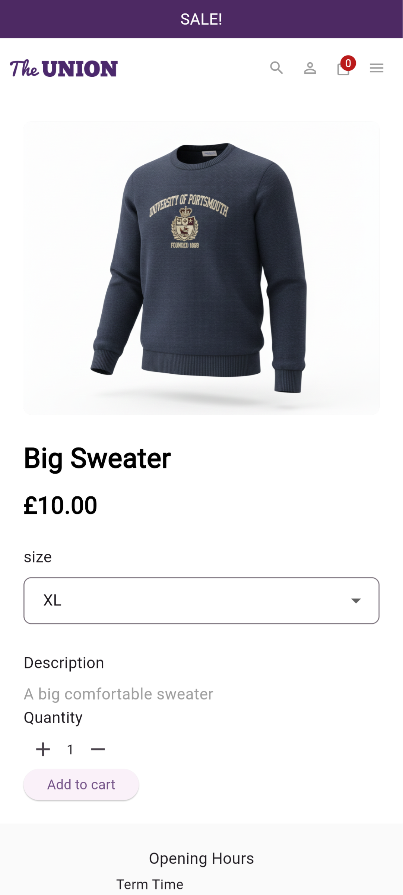
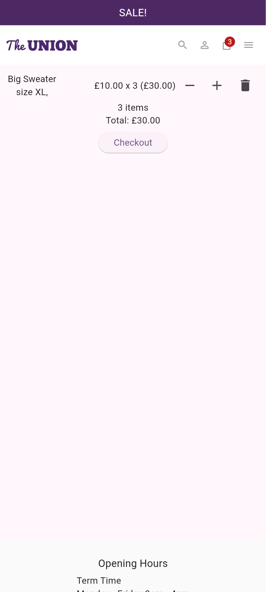

# Union Shop - Flutter Coursework

Repository containing the code for the Flutter Coursework as part of the *Programming Applications and Programming Languages* module at the University of Portsmouth.

# Screenshots





# Features

- Adding products to a cart.
- Changing selected product attributes before adding to cart.
- Modifying the quantities of products in a cart, including being able to remove them.
- Mock placing orders from cart.
- Browsing collections and products, which are contained inside collections.
- Sale collection to show discounted products.
- Navigation to all pages.
- Searching for products by name or description.

# Getting started

## Prerequesites

- Flutter SDK >=2.17.0 <4.0.0
- VSCode (recommended IDE for development)
- Git

Once you have installed Flutter, ensure it is working correctly by running:
```
flutter pub get
```

## Installation

1. Clone the repository
    ```
    git clone https://github.com/sccreeper/union_shop.git
    cd ./union_shop/
    ```

2. Install project dependencies
    ```
    flutter pub get
    ```

3. Run the app
    ```
    flutter run -d chrome
    ```

## Run tests

Tests can be run using `flutter test`. Alternatively, a coverage report can be generated using `flutter test --coverage`. The report can be viewed using [lcov-viewer](https://lcov-viewer.netlify.app/report).

# Project structure

- `lib` - Contains shared project code
- `lib/layouts` - Code for shared base layouts
- `lib/models` - Models for representing data
- `lib/repositories` - Repositories for loading and querying application/product data.
- `lib/util` - Util files for common functionality
- `lib/views` - All app views, important ones are listed below:
    - `cart_page.dart` - Code for the cart management UI.
    - `product_page.dart` - Code for the product page.
    - `home.dart` - The home page.
- `widgets` - Code for common widgets which are shared between multiple views.
- `android`, `ios`, `macos`, `linux`, `windows`, `web` - Platform specfic code
- `test` - Contains all tests, same layout as lib, with each folder containing the corresponding tests.

# Libaries used

- Flutter - UI framework
- go_router - Routing library for navigation
- provider - Library for managing state

# Generative AI Notes

Two parts of this project were exclusively AI generated: the product images, and the product and collection data.

The product and collection data was generated by prompting an LLM in the following format:


> Look at the schema in `schema.json`, please generate n more collections/products using the same schema and place them in `file.json`.